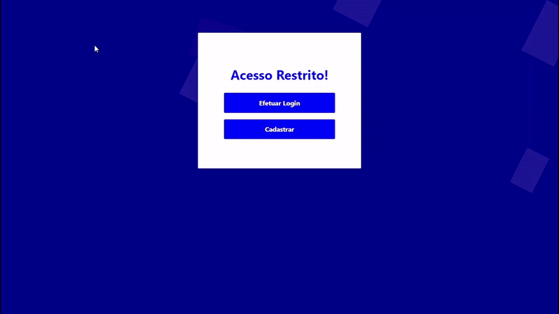

# :closed_lock_with_key: Autenticação sem Senhas
Implementação de um sistema de autenticação *passowordless* (sem senhas). A aplicação permite a auntenticação por meio de um link enviado ao e-mail do usuário que deseja ter acesso aos recursos do sistema.

O fluxo implementado funciona da seguinte maneira:
- O usuário especifica o seu e-mail cadastrado no banco de dados.
- Um token de curta duração é gerado e codificado como um *link* para o *frontend*.
- Uma messagem é enviada para o e-mail especificado, contendo o *link* para a autenticação.
- Ao clicar no *link*, o *frontend* utiliza o token contido no endereço para requisitar outro token com vida útil prolongada.
- O *frontend* pode agora consumir recursos utilizando esse token de acesso.

## :repeat: Backend

### :rocket: Tecnologias
- [Node.js](https://nodejs.org/en/)
- [Json Web Tokens](https://jwt.io/)
- [SQLite](https://www.sqlite.org/index.html)

**:package: Bibliotecas**

- [Express](https://expressjs.com)
- [Knex](http://knexjs.org/)
- [Nodemailer](https://nodemailer.com/about/)

## :computer: Frontend

### :rocket: Tecnologias
- [HTML](https://developer.mozilla.org/pt-BR/docs/Web/HTML)
- [CSS](https://developer.mozilla.org/pt-BR/docs/Archive/CSS3)
- [Javascript](https://www.javascript.com/)

---

:coffee: Desenvolvido por Daniel Santos

